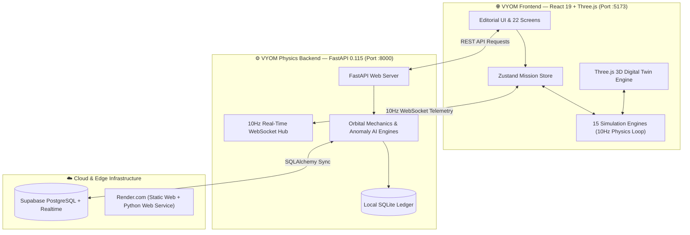

# 🪐 VYOM Architecture & Data Flow Diagrams

Comprehensive visual documentation of **VYOM — Intelligent Digital Space Mission Twin & Autonomous Mission Control Platform**.

---

## 📑 Diagram Index

| Diagram Document | Focus & Highlights |
| :--- | :--- |
| **[system-architecture.md](./system-architecture.md)** | Full-stack layered architecture (React 19 + Three.js Frontend, FastAPI 10Hz Backend, Supabase Cloud & Render deployment). |
| **[digital-twin-architecture.md](./digital-twin-architecture.md)** | Real-time 10Hz physical state model, Keplerian & J2 orbital mechanics, Three.js spatial environment sync, and subsystem coupling. |
| **[data-flow.md](./data-flow.md)** | End-to-end user actions, WebSocket bidirectional telemetry stream, 12-channel HUD data flow, and 22-screen lifecycle state machine. |
| **[threat-ai-pipeline.md](./threat-ai-pipeline.md)** | 3σ anomaly detection, Space Environment threat matrix, VYOM AI copilot candidate trade studies, safety gates, and immutable Black Box ledger. |
| **[engine-architecture.md](./engine-architecture.md)** | Frontend 15-module simulation ecosystem, central MissionEventBus, and multi-subsystem safety validation chain. |
| **[frontend-architecture.md](./frontend-architecture.md)** | Complete 22-screen component tree, Three.js 3D viewport hierarchy, UI primitives, and Zustand reactive state flows. |
| **[backend-api.md](./backend-api.md)** | FastAPI application structure, 16 REST routers, WebSocket connection lifecycle, and physics engine modules. |

---

## 🛰️ High-Level System Overview

