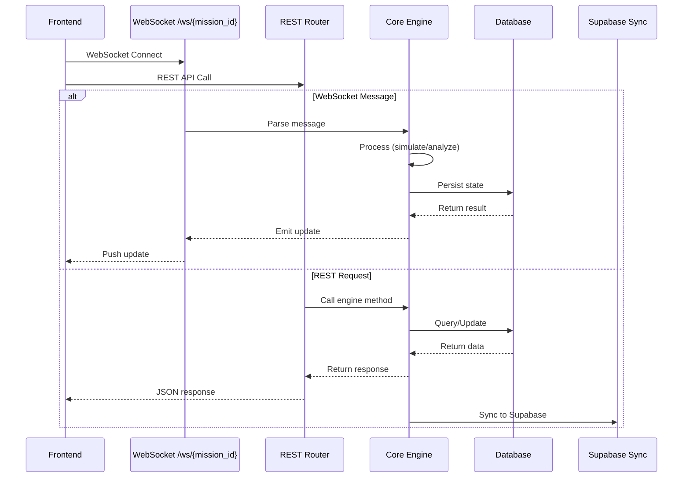

# VYOM Backend API Architecture

## FastAPI Application Structure

```mermaid
graph TB
    Main["main.py<br/>FastAPI App v3.0.0"]

    subgraph "Middleware"
        CORS["CORSMiddleware<br/>allow_origins=['*']<br/>credentials=False"]
    end

    subgraph "Lifespan"
        Lifespan["@asynccontextmanager<br/>init_db() · seed_architectures()"]
    end

    Main --> CORS
    Main --> Lifespan

    subgraph "WebSocket"
        WS["/ws/{mission_id}<br/>websocket_endpoint()"]
    end

    subgraph "REST Routers (16 total)"
        R1["/api/missions · missions_router"]
        R2["/api/faults · faults_router"]
        R3["/api/telemetry<br/>telemetry_router · blackbox_router · commands_router"]
        R4["/api/reports · reports_router"]
        R5["/api/incidents · incidents_router"]
        R6["/api/crew · crew_router"]
        R7["/api/risk · risk_router"]
        R8["/api/objectives · objectives_router"]
        R9["/api/activities · activities_router"]
        R10["/api/trajectory · trajectory_router"]
        R11["/api/farewell · farewell_router"]
        R12["/api/architectures · architectures_router"]
        R13["/api/scenarios · scenarios_router"]
        R14["/api/timeline · timeline_router"]
        R15["/api/orbital · orbital_router"]
        R16["/health · root endpoint"]
    end

    Main --> WS
    Main --> R1
    Main --> R2
    Main --> R3
    Main --> R4
    Main --> R5
    Main --> R6
    Main --> R7
    Main --> R8
    Main --> R9
    Main --> R10
    Main --> R11
    Main --> R12
    Main --> R13
    Main --> R14
    Main --> R15
    Main --> R16
```

## Module Organization

```mermaid
graph TB
    subgraph "api/ — Route Handlers (14 files)"
        A1["activities.py"]
        A2["architectures.py"]
        A3["crew.py"]
        A4["farewell_api.py"]
        A5["faults.py"]
        A6["incidents.py"]
        A7["missions.py"]
        A8["objectives.py"]
        A9["orbital_api.py"]
        A10["reports.py"]
        A11["risk.py"]
        A12["scenarios_api.py"]
        A13["telemetry.py"]
        A14["timeline_api.py"]
        A15["trajectory_api.py"]
        A16["websocket.py"]
    end

    subgraph "core/ — Core Services (7 modules)"
        C1["database.py · SQLAlchemy ORM"]
        C2["schemas.py · Pydantic models"]
        C3["blackbox.py · Recorder"]
        C4["architecture_seed.py · Seed data"]
        C5["report_builder.py · PDF generation"]
        C6["migrations.py · Alembic"]
        C7["supabase_service.py · Sync"]
    end

    subgraph "engines/ — Business Logic (18 modules)"
        E1["ai_guardian.py"]
        E2["anomaly_detector.py"]
        E3["command_engine.py"]
        E4["crew_health_engine.py"]
        E5["daily_summary_engine.py"]
        E6["environment_engine.py"]
        E7["farewell_engine.py"]
        E8["fault_engine.py"]
        E9["incident_engine.py"]
        E10["manual_recovery_engine.py"]
        E11["recovery_engine.py"]
        E12["risk_engine.py"]
        E13["rul_engine.py"]
        E14["scenario_engine.py"]
        E15["spacecraft_state.py"]
        E16["telemetry_engine.py"]
        E17["tle_engine.py"]
        E18["trajectory_engine.py"]
        subgraph "engines/physics/"
            P1["orbital.py · Orbital mechanics"]
        end
    end

    subgraph "simulation/"
        SL["loop.py · Main sim loop"]
    end

    A1 --> C1
    A7 --> C1
    A13 --> C1
    SL --> C1
    SL --> E16
    SL --> E17

    C1 --> C2
    C1 --> C3
    C1 --> C7
```



## Request Processing Flow


