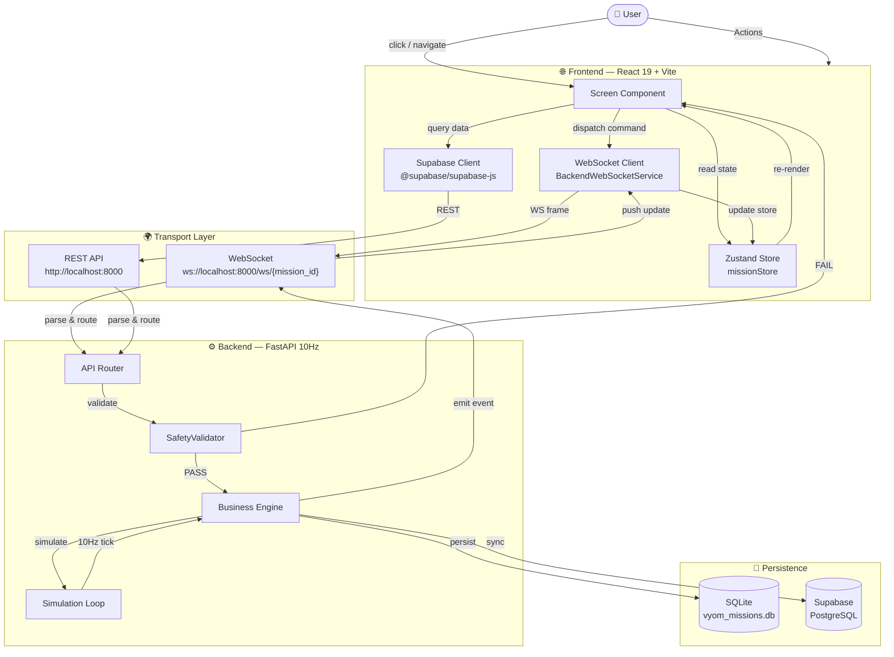
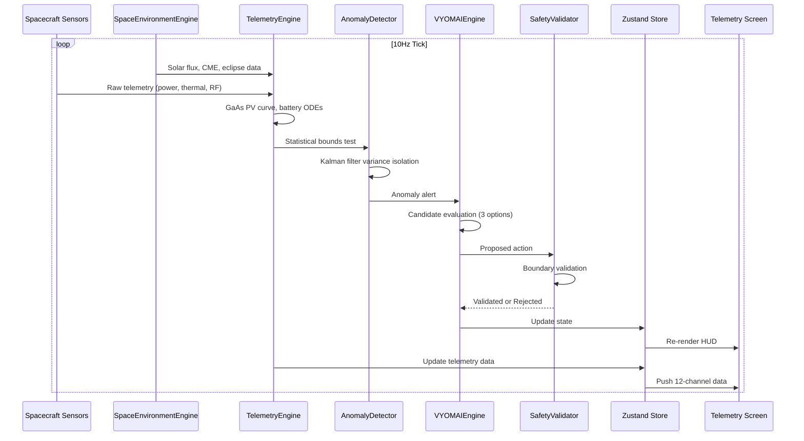
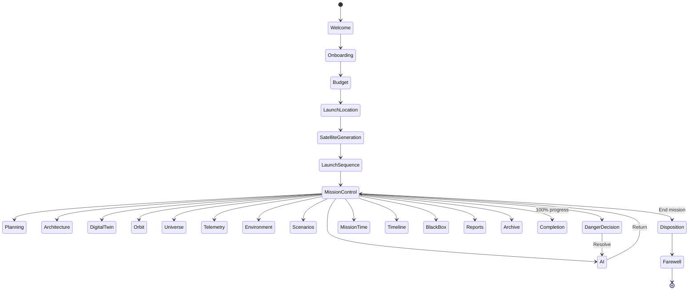

# VYOM Data Flow Diagram

## End-to-End Data Flow

```mermaid
flowchart TB
    User([👤 User]) -->|Actions| Frontend

    subgraph Frontend["🌐 Frontend — React 19 + Vite"]
        Screen["Screen Component"]
        Store["Zustand Store<br/>missionStore"]
        WS_Client["WebSocket Client<br/>BackendWebSocketService"]
        Supabase_C["Supabase Client<br/>@supabase/supabase-js"]
    end

    subgraph Transport["🌍 Transport Layer"]
        REST["REST API<br/>http://localhost:8000"]
        WS["WebSocket<br/>ws://localhost:8000/ws/{mission_id}"]
    end

    subgraph Backend["⚙️ Backend — FastAPI 10Hz"]
        Router["API Router"]
        Engine["Business Engine"]
        Validator["SafetyValidator"]
        Loop["Simulation Loop"]
    end

    subgraph Persistence["💾 Persistence"]
        SQLite[("SQLite<br/>vyom_missions.db")]
        Supabase[(Supabase<br/>PostgreSQL)]
    end

    User -->|click / navigate| Screen
    Screen -->|read state| Store
    Screen -->|dispatch command| WS_Client
    Screen -->|query data| Supabase_C

    WS_Client -->|WS frame| WS
    Supabase_C -->|REST| REST

    WS -->|parse & route| Router
    REST -->|parse & route| Router
    Router -->|validate| Validator
    Validator -->|PASS| Engine
    Validator -->|FAIL| Screen
    Engine -->|simulate| Loop
    Engine -->|persist| SQLite
    Engine -->|sync| Supabase
    Loop -->|10Hz tick| Engine
    Engine -->|emit event| WS
    WS -->|push update| WS_Client
    WS_Client -->|update store| Store
    Store -->|re-render| Screen
```

## Telemetry Data Pipeline (10Hz)

```mermaid
sequenceDiagram
    participant Sensor as Spacecraft Sensors
    participant Env as SpaceEnvironmentEngine
    participant Telemetry as TelemetryEngine
    participant Anomaly as AnomalyDetector
    participant AI as VYOMAIEngine
    participant Safety as SafetyValidator
    participant Store as Zustand Store
    participant HUD as Telemetry Screen

    loop 10Hz Tick
        Env->>Telemetry: Solar flux, CME, eclipse data
        Sensor->>Telemetry: Raw telemetry (power, thermal, RF)
        Telemetry->>Telemetry: GaAs PV curve, battery ODEs
        Telemetry->>Anomaly: Statistical bounds test
        Anomaly->>Anomaly: Kalman filter variance isolation
        Anomaly->>AI: Anomaly alert
        AI->>AI: Candidate evaluation (3 options)
        AI->>Safety: Proposed action
        Safety->>Safety: Boundary validation
        Safety-->>AI: Validated or Rejected
        AI->>Store: Update state
        Store->>HUD: Re-render HUD
        Telemetry->>Store: Update telemetry data
        Store->>HUD: Push 12-channel data
    end
```

## Fault Cascade Propagation

```mermaid
flowchart LR
    Trigger["Fault Trigger<br/>e.g. Solar Flux -40%"]
    Trigger --> Power["Power System<br/>EPS"]
    Power -->|"3.2x battery drain"| Battery["Battery System"]
    Battery -->|"-15°C thermal"| Thermal["Thermal System TCS"]
    Thermal -->|"TWTA half-power"| RF["RF Communications"]
    RF -->|"mission lifetime ↓"| Mission["Mission Lifetime"]
    Mission -->|"cascade"| AI["AI Autonomous Recovery"]
    AI -->|"3 candidates"| Eval["Evaluate & Select"]
    Eval -->|"optimal plan"| Safety["SafetyValidator"]
    Safety -->|"execute"| Act["Execute Recovery"]
    Act -->|"confirm 3σ"| Monitor["Monitor Recovery"]
    Monitor -->|"success"| Normal["Return to Nominal"]
    Monitor -->|"fail"| Escalate["Escalate to Danger Decision"]
```

## Mission Lifecycle State Flow

```mermaid
stateDiagram-v2
    [*] --> Welcome
    Welcome --> Onboarding
    Onboarding --> Budget
    Budget --> LaunchLocation
    LaunchLocation --> SatelliteGeneration
    SatelliteGeneration --> LaunchSequence
    LaunchSequence --> MissionControl

    MissionControl --> Planning
    MissionControl --> Architecture
    MissionControl --> DigitalTwin
    MissionControl --> Orbit
    MissionControl --> Universe
    MissionControl --> Telemetry
    MissionControl --> Environment
    MissionControl --> Scenarios
    MissionControl --> DangerDecision
    MissionControl --> AI
    MissionControl --> MissionTime
    MissionControl --> Timeline
    MissionControl --> BlackBox
    MissionControl --> Reports
    MissionControl --> Archive

    MissionControl --> Completion: 100% progress
    MissionControl --> Disposition: End mission
    Disposition --> Farewell
    Farewell --> [*]

    DangerDecision --> AI: Resolve
    AI --> MissionControl: Return
```
