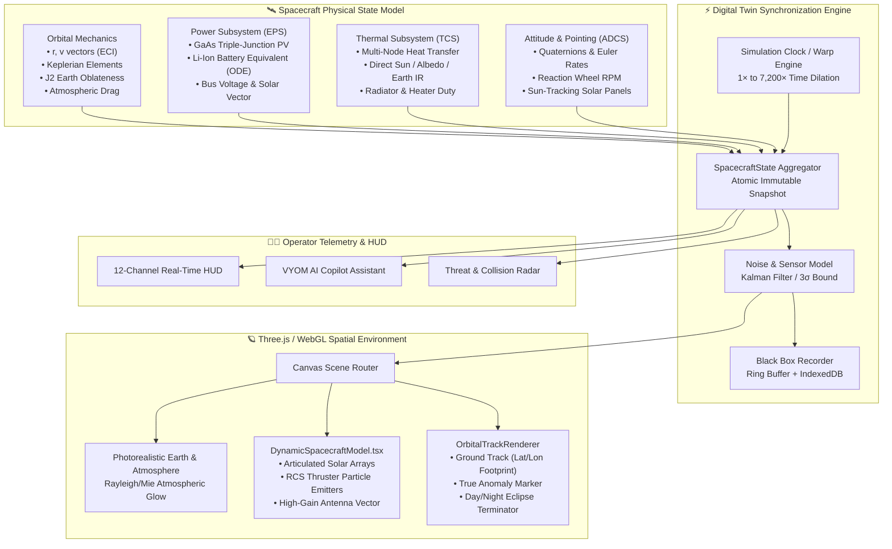
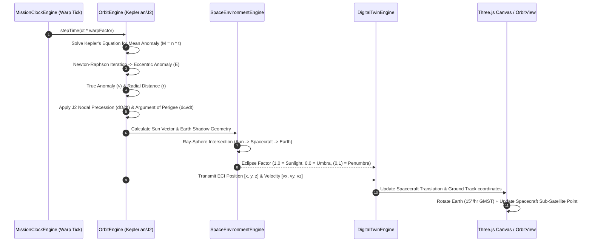
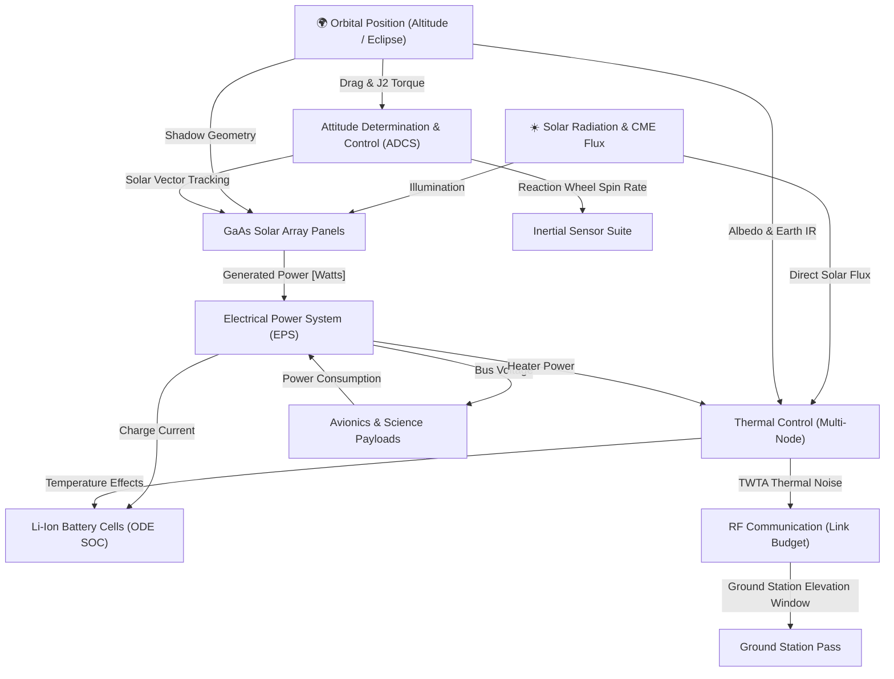

# VYOM Digital Twin Architecture & Synchronization

This document diagrams how the **1:1 Physics-Grounded Digital Twin** synchronizes real-time spacecraft telemetry, orbital propagation (J2 perturbation), 3D WebGL visualization, and bi-directional command telemetry.

---

## 1. Digital Twin Real-Time Synchronization Loop (10Hz / 100ms)

---

## 2. Orbital Mechanics & Two-Body Propagation Flow

---

## 3. Dynamic Spacecraft Subsystem Dependency Graph

