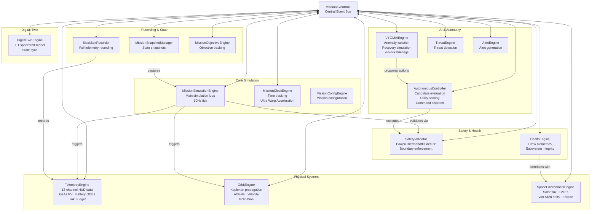
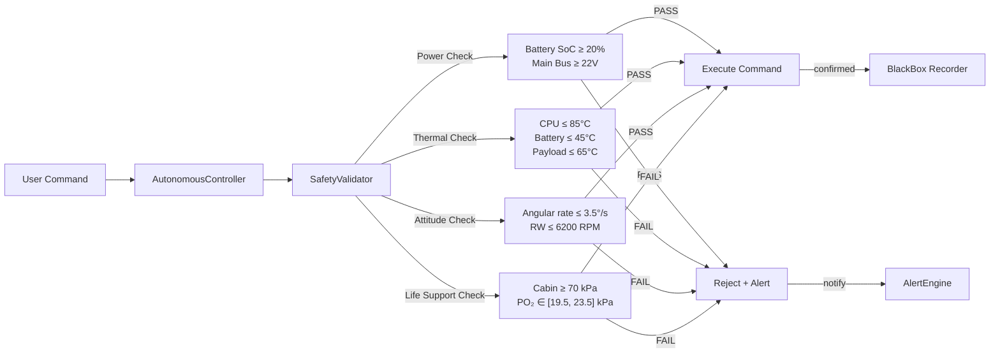

# VYOM Engine Architecture

## Frontend Engine Ecosystem

```mermaid
graph TB
    EventBus["MissionEventBus<br/>Central Event Bus"]

    subgraph "Core Simulation"
        Sim["MissionSimulationEngine<br/>Main simulation loop<br/>10Hz tick"]
        Clock["MissionClockEngine<br/>Time tracking<br/>Ultra Warp Acceleration"]
        Config["MissionConfigEngine<br/>Mission configuration"]
    end

    subgraph "Physical Systems"
        Telemetry["TelemetryEngine<br/>12-channel HUD data<br/>GaAs PV · Battery ODEs<br/>Link Budget"]
        Orbit["OrbitEngine<br/>Keplerian propagation<br/>Altitude · Velocity<br/>Inclination"]
        Env["SpaceEnvironmentEngine<br/>Solar flux · CMEs<br/>Van Allen belts · Eclipse"]
    end

    subgraph "AI & Autonomy"
        AI["VYOMAIEngine<br/>Anomaly isolation<br/>Recovery simulation<br/>4-block briefings"]
        AutoCtrl["AutonomousController<br/>Candidate evaluation<br/>Utility scoring<br/>Command dispatch"]
        Threat["ThreatEngine<br/>Threat detection"]
        Alert["AlertEngine<br/>Alert generation"]
    end

    subgraph "Safety & Health"
        Safety["SafetyValidator<br/>Power/Thermal/Attitude/Life<br/>Boundary enforcement"]
        Health["HealthEngine<br/>Crew biometrics<br/>Subsystem integrity"]
    end

    subgraph "Recording & State"
        BlackBox["BlackBoxRecorder<br/>Full telemetry recording"]
        Snapshot["MissionSnapshotManager<br/>State snapshots"]
        Objectives["MissionObjectiveEngine<br/>Objective tracking"]
    end

    subgraph "Digital Twin"
        DT["DigitalTwinEngine<br/>1:1 spacecraft model<br/>State sync"]
    end

    EventBus <--> Sim
    EventBus <--> Clock
    EventBus <--> Telemetry
    EventBus <--> Orbit
    EventBus <--> Env
    EventBus <--> AI
    EventBus <--> AutoCtrl
    EventBus <--> Safety
    EventBus <--> Health
    EventBus <--> BlackBox
    EventBus <--> Snapshot
    EventBus <--> DT
    EventBus <--> Objectives
    EventBus <--> Threat
    EventBus <--> Alert

    Sim -->|"triggers"| Telemetry
    Sim -->|"triggers"| Orbit
    Sim -->|"validates via"| Safety
    AI -->|"proposes actions"| AutoCtrl
    AutoCtrl -->|"executes"| Safety
    Health -->|"correlates with"| Env
    BlackBox -->|"records"| Telemetry
    Snapshot -->|"captures"| Sim
```

## Safety Validation Chain

```mermaid
graph LR
    Command["User Command"] --> AutoCtrl["AutonomousController"]
    AutoCtrl --> Safety["SafetyValidator"]
    Safety -->|"Power Check"| Power["Battery SoC ≥ 20%<br/>Main Bus ≥ 22V"]
    Safety -->|"Thermal Check"| Thermal["CPU ≤ 85°C<br/>Battery ≤ 45°C<br/>Payload ≤ 65°C"]
    Safety -->|"Attitude Check"| Attitude["Angular rate ≤ 3.5°/s<br/>RW ≤ 6200 RPM"]
    Safety -->|"Life Support Check"| Life["Cabin ≥ 70 kPa<br/>PO₂ ∈ [19.5, 23.5] kPa"]

    Power -->|"PASS"| Execute["Execute Command"]
    Thermal -->|"PASS"| Execute
    Attitude -->|"PASS"| Execute
    Life -->|"PASS"| Execute

    Power -->|"FAIL"| Reject["Reject + Alert"]
    Thermal -->|"FAIL"| Reject
    Attitude -->|"FAIL"| Reject
    Life -->|"FAIL"| Reject

    Execute -->|"confirmed"| BlackBox["BlackBox Recorder"]
    Reject -->|"notify"| Alert["AlertEngine"]
```
