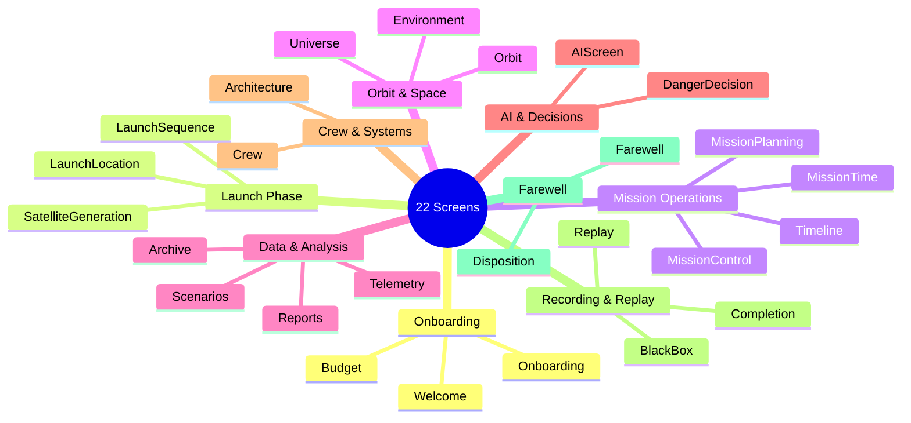
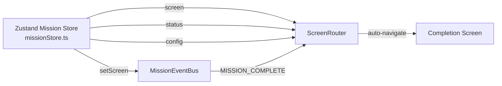

# VYOM Frontend Architecture

## App Component Tree

```mermaid
graph TD
    App["App.tsx<br/>React 19 Root<br/>Global CSS + Background"] --> ScreenRouter["ScreenRouter<br/>AnimatePresence + motion.div"]
    App --> Navigation["Navigation.tsx<br/>Top-level nav bar"]

    ScreenRouter --> Welcome["WelcomeScreen"]
    ScreenRouter --> Onboarding["OnboardingScreen"]
    ScreenRouter --> Budget["BudgetScreen"]
    ScreenRouter --> LaunchLocation["LaunchLocationScreen"]
    ScreenRouter --> SatelliteGen["SatelliteGenerationScreen"]
    ScreenRouter --> LaunchSeq["LaunchSequenceScreen"]
    ScreenRouter --> MissionControl["MissionControlScreen"]
    ScreenRouter --> Crew["CrewScreen<br/>(config.type === 'human')"]
    ScreenRouter --> Planning["MissionPlanningScreen"]
    ScreenRouter --> Architecture["ArchitectureSelectionScreen"]
    ScreenRouter --> DigitalTwin["DigitalTwinScreen"]
    ScreenRouter --> Orbit["OrbitScreen"]
    ScreenRouter --> Universe["UniverseScreen"]
    ScreenRouter --> Telemetry["TelemetryScreen"]
    ScreenRouter --> Environment["EnvironmentScreen"]
    ScreenRouter --> Scenarios["ScenariosScreen"]
    ScreenRouter --> Danger["DangerDecisionScreen"]
    ScreenRouter --> AIScreen["AIScreen"]
    ScreenRouter --> MissionTime["MissionTimeScreen"]
    ScreenRouter --> Timeline["TimelineScreen"]
    ScreenRouter --> BlackBox["BlackBoxScreen"]
    ScreenRouter --> Replay["ReplayScreen"]
    ScreenRouter --> Reports["ReportsScreen"]
    ScreenRouter --> Archive["ArchiveScreen"]
    ScreenRouter --> Completion["CompletionScreen"]
    ScreenRouter --> Disposition["DispositionScreen"]
    ScreenRouter --> Farewell["FarewellScreen"]

    ScreenRouter -->|MISSION_COMPLETE event| Completion
```



## Screen Categorization



## Component Hierarchy by Category

```mermaid
graph TB
    subgraph "3D / WebGL"
        ThreeJS["Three.js Components"]
        ThreeJS --> SatelliteScene
        ThreeJS --> SpaceScene
        ThreeJS --> CrewAnatomyScene
        ThreeJS --> DynamicSpacecraftModel
        ThreeJS --> OrbitalTrackingPanel
        ThreeJS --> SpacePathRenderer
        ThreeJS --> CelestialTextures
        ThreeJS --> MissionRiskPanel
        ThreeJS --> WhatIfComparison
    end

    subgraph "2D Screens"
        Screens["Screen Components"]
        Screens --> WelcomeScreen
        Screens --> TelemetryScreen
        Screens --> MissionControlScreen
        Screens --> ReportsScreen
        Screens --> AIScreen
    end

    subgraph "UI Primitives"
        UI["UI Components"]
        UI --> Navigation
        UI --> HealthRing
        UI --> TelemetryMini
        UI --> InteractiveEarthBackground
    end

    subgraph "Cinematics"
        Cinematics["Cinematic Components"]
        Cinematics --> MissionCinematicPlayer
        Cinematics --> MissionStorytellingScroll
    end

    ThreeJS -->|renders in| Screens
    UI -->|used by| Screens
    Cinematics -->|playback in| MissionControl
```

## State Management Flow


