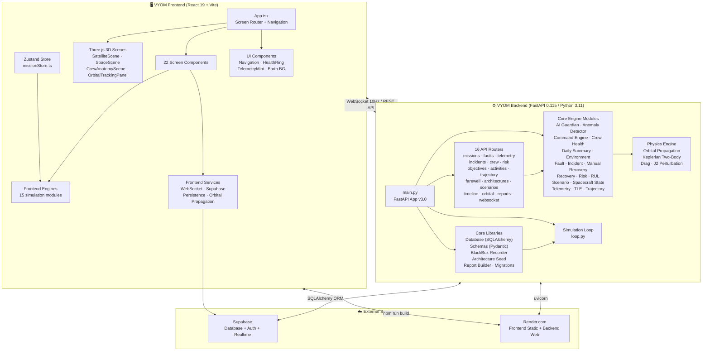
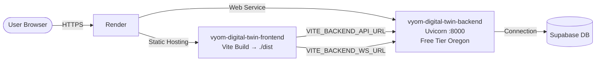

# VYOM System Architecture



## Technology Stack

```mermaid
flowchart LR
    A[Frontend] -->|React 19| B(TypeScript)
    A -->|Vite 8| C(@react-three/fiber)
    A -->|Three.js| D(framer-motion)
    A -->|Recharts| E(d3)
    A -->|Zustand| F(idb)
    A -->|jsPDF| G(@supabase/supabase-js)

    H[Backend] -->|FastAPI| I(Uvicorn)
    H -->|SQLAlchemy 2.0| J(NumPy / SciPy)
    H -->|WebSockets| K(Pydantic)
    H -->|ReportLab| L(Python-Multipart)
    H -->|Alembic| M(httpx)
```

## Deployment Architecture


