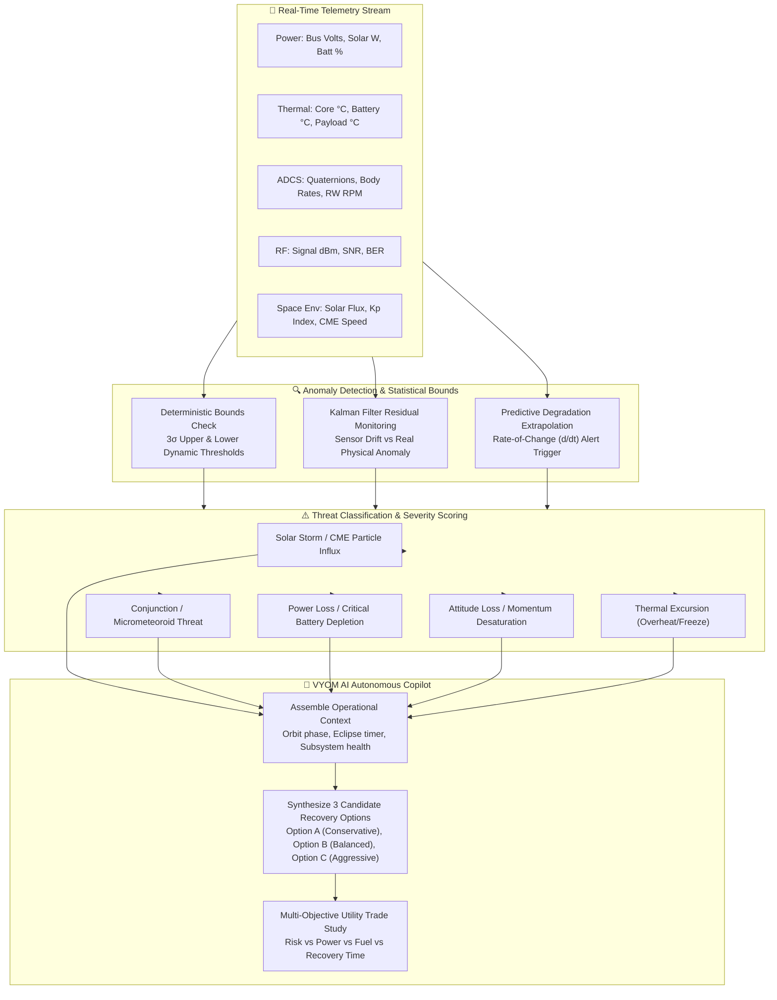
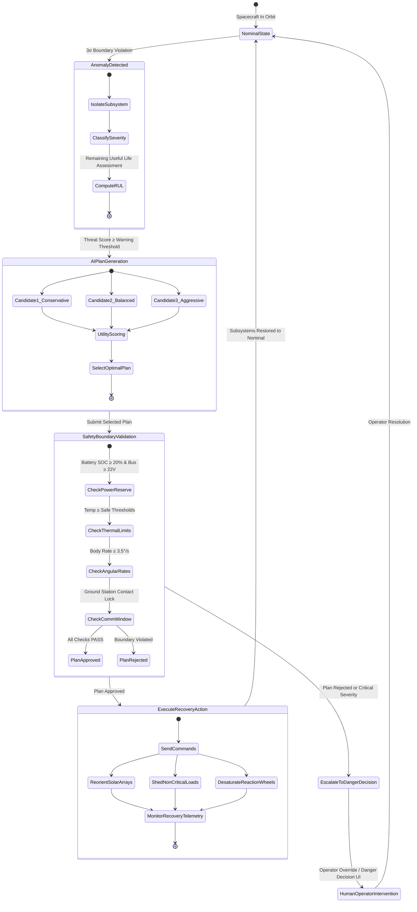
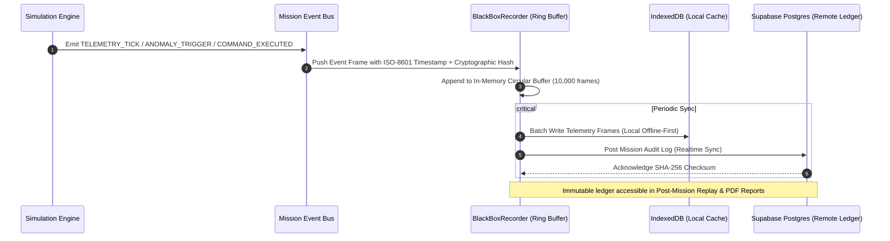

# VYOM Threat Detection & AI Autonomous Copilot Pipeline

This document visualizes the **Anomaly Detection Engine**, **Space Environment Threat Pipeline**, **VYOM AI Autonomous Copilot Decision Tree**, and **Safety Boundary Validation Chain**.

---

## 1. Threat Detection & Anomaly Isolation Pipeline

---

## 2. Autonomous Decision & Safety Gate State Machine

---

## 3. Black Box Immutable Audit Ledger

